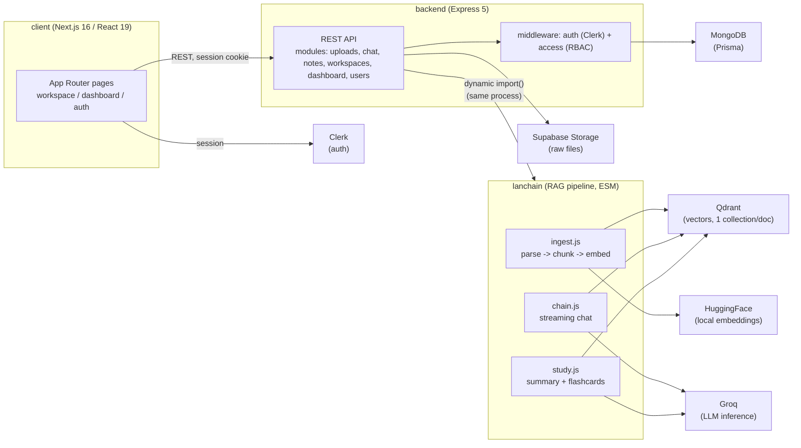

# Architecture

Padhle is three independently-managed Node packages plus three external
managed services. There's no monorepo tool (no Turborepo/Nx) — each package
has its own `package.json`, lockfile, and `.env`.

## Why backend and lanchain share a process

`backend/src/lib/rag.js` loads `lanchain/src/index.js` via a dynamic
`import()` of a relative path, not an HTTP call — the two packages are
deployed and scaled together today. See
[ADR-001](./adr/001-lanchain-in-process.md) for why, and what the planned
split looks like (tracked in `features.md` Phase 1).

## Request flow: uploading a document

1. Client `POST`s a file to `backend`'s `/workspaces/:id/documents` route
   (`multer`, 25MB cap, PDF/DOCX/PPTX/TXT).
2. `backend` uploads the raw file to Supabase Storage, creates a `Document`
   row (`status: PROCESSING`), and returns immediately.
3. In the background, `backend` calls into `lanchain` to parse the file
   (format-specific loader — PDF page-aware, OCR fallback via Tesseract for
   scanned pages; DOCX/PPTX/TXT via a generic chunker), embed each chunk
   locally (HuggingFace transformers, no per-chunk API call), and upsert
   into a new Qdrant collection named after the document.
4. On success/failure, `backend` flips `Document.status` to `READY`/`FAILED`.

## Request flow: chatting with a document

1. Client sends a question against one or more documents in a workspace.
2. `backend` resolves the caller's role via `middleware/access.js`
   (workspace-scoped RBAC: VIEWER/EDITOR/OWNER).
3. `lanchain`'s `chain.js` retrieves top-k chunks per document from Qdrant,
   merges across documents, and streams a Groq-generated, source-cited
   answer back through `backend` to the client.

## Data stores

| Store | Holds | Notes |
|---|---|---|
| MongoDB (via Prisma) | Users, workspaces, documents, conversations, messages, notes, activity | Soft deletes via `deletedAt`; see `backend/prisma/schema.prisma` |
| Qdrant | Chunk embeddings | One collection per document, named by `Document.vectorNamespace` |
| Supabase Storage | Raw uploaded files | Private bucket, service-role key server-side only |
