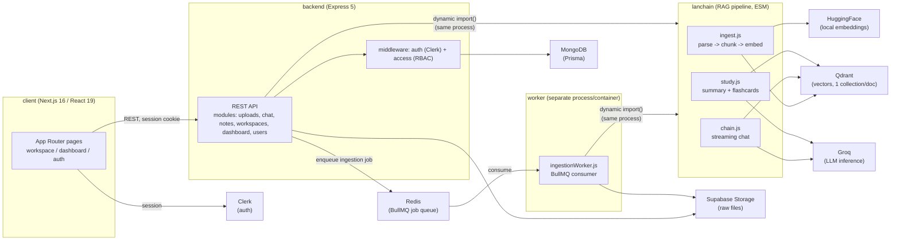

# Architecture

Padhle is three independently-managed Node packages plus three external
managed services. There's no monorepo tool (no Turborepo/Nx) — each package
has its own `package.json`, lockfile, and `.env`.

## Why backend and lanchain share a process

`backend/src/lib/rag.js` loads `lanchain/src/index.js` via a dynamic
`import()` of a relative path, not an HTTP call — the two packages are
deployed and scaled together today. See
[ADR-001](./adr/001-lanchain-in-process.md) for why, and what the planned
split looks like (tracked in `features.md` Phase 1).

## Request flow: uploading a document

1. Client `POST`s a file to `backend`'s `/workspaces/:id/documents` route
   (`multer`, 25MB cap, PDF/DOCX/PPTX/TXT).
2. `backend` uploads the raw file to Supabase Storage, creates a `Document`
   row (`status: PROCESSING`), enqueues an ingestion job on the BullMQ
   queue (`lib/queue.js`), and returns immediately — the client polls
   `GET .../documents` and watches `status`/`ingestProgress` update.
3. The separate `worker` process (`jobs/ingestionWorker.js`) picks up the
   job, downloads the file back from Supabase Storage, and calls into
   `lanchain` to parse it (format-specific loader — PDF page-aware, OCR
   fallback via Tesseract for scanned pages; DOCX/PPTX/TXT via a generic
   chunker), embed each chunk locally (HuggingFace transformers, no
   per-chunk API call), and upsert into a new Qdrant collection named after
   the document.
4. On success, the worker flips `Document.status` to `READY`. On failure it
   retries up to 3 times with exponential backoff; once exhausted, the
   document flips to `FAILED` and the failed BullMQ job is kept as a
   dead-letter record — `POST .../documents/:id/retry` re-enqueues it.

## Request flow: chatting with a document

1. Client sends a question against one or more documents in a workspace.
2. `backend` resolves the caller's role via `middleware/access.js`
   (workspace-scoped RBAC: VIEWER/EDITOR/OWNER).
3. `lanchain`'s `chain.js` retrieves top-k chunks per document from Qdrant,
   merges across documents, and streams a Groq-generated, source-cited
   answer back through `backend` to the client.

## Data stores

| Store | Holds | Notes |
|---|---|---|
| MongoDB (via Prisma) | Users, workspaces, documents, conversations, messages, notes, activity | Soft deletes via `deletedAt`; see `backend/prisma/schema.prisma` |
| Qdrant | Chunk embeddings | One collection per document, named by `Document.vectorNamespace` |
| Supabase Storage | Raw uploaded files | Private bucket, service-role key server-side only |
| Redis | BullMQ job queue (ingestion) | Also the dead-letter store — failed jobs are kept (`removeOnFail` capped, not disabled) for `POST .../documents/:id/retry` |

## API docs, hardening, and observability

- OpenAPI spec at `backend/src/openapi.yaml`, served via Swagger UI at
  `/docs` (raw JSON at `/docs/openapi.json`).
- `helmet`, a global `express-rate-limit`, and `zod` request-body validation
  (`middleware/validate.js` + each module's `validation.js`) sit in front of
  every route.
- Every controller is wrapped in `lib/asyncHandler.js` and funnels errors
  into `middleware/errorHandler.js`, which infers a status code from the
  error (an explicit `AppError(message, statusCode)`, a `"... not found"`
  message → 404, a validation-shaped message → 400, anything else → 500 with
  the message hidden from the client). 500s are logged via `pino`
  (`pino-http` for request logs) and reported to Sentry if `SENTRY_DSN` is
  set (`lib/sentry.js` — a no-op otherwise).
